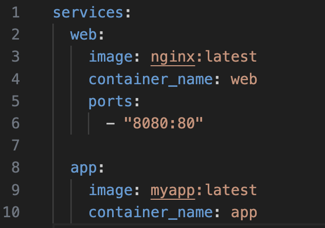
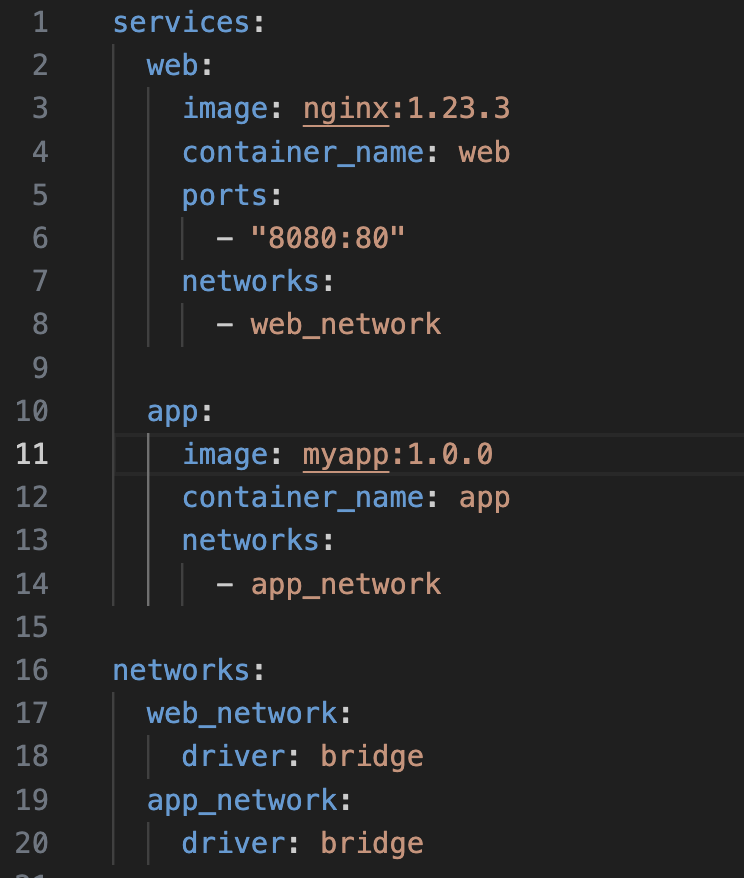

# Лабораторная работа №3

Выполнили: Коваленко Евгений Юрьевич, Шаповалов Сергей Кириллович, K3141

## “Плохой” docker-compose



## “Хороший” docker-compose



## Объяснение и решений проблем

1. Использование ```latest``` версий может привести к неожиданному поведению контейнера и непредвиденным конфликтам, так как в последних версиях могут создаваться конфликты на фоне неподдерживаемых файлов. Решением стало использование конкретной версии.

2. Не указан драйвер сети. В ```good_docker-compose``` мы его добавили, и это позволяет нам оптимизировать производительность и безопасность сети в зависимости от наших требований.

3. Добавление ```container_name``` упрощает управление контейнерами, так как обращаться к ним по понятным именам легче, чем по автоматически созданным docker.


4. Не указана сеть. В ```good_docker-compose``` мы добавили ```web_network``` и ```app_network```, то есть создаем две отдельные сети, чтобы контейнеры не могли видеть друг друга. Контейнер ```web``` подключен к ```web_network```, а контейнер ```app``` к ```app_network```. Это значит, что оба контейнера могут работать одновременно, но они изолированы друг от друга.

## Вывод по лабораторной

Хорошая лабораторная, будем еще думать, что можно добавить. Думаю, что еще много всего можно найти, подумать об этом и решить какие-то еще bad practices.😃