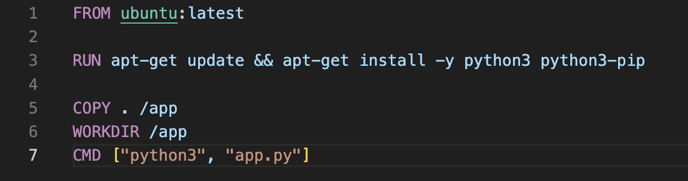
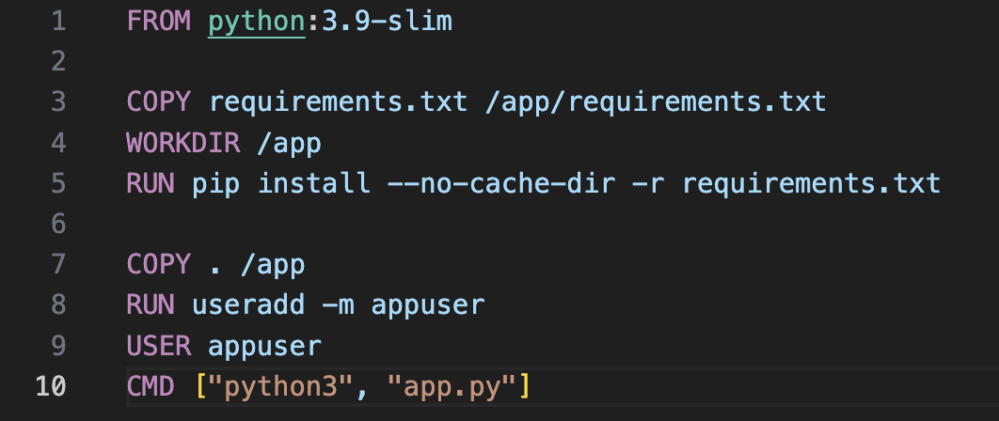

# Лабораторная работа №2

Выполнили: Коваленко Евгений Юрьевич, Шаповалов Сергей Кириллович, K3141

## “Плохой” Dockerfile

## “Хороший” Dockerfile

## Объяснение и решений проблем

1. Использование тяжелого образа «FROM ubuntu». Недостатки этого заключаются в том, что он включает множество ненужных компонентов, увеличивает размер контейнера и, соответственно, замедляет его загрузку. Решение проблемы — использование минимального образа «FROM python:3.9-slim». Это позволит уменьшить размер контейнера и ускорить его загрузку.

2. Установка пакетов без указания версии и очистки кэша может привести к проблемам с воспроизводимостью и увеличению размера образа. Решение — указание точных версий пакетов в файле requirements.txt и установка с флагом «--no-cache-dir», чтобы избежать сохранения ненужных файлов. Это поможет уменьшить размер образа и улучшить воспроизводимость. 

3. Запуск приложения от имени пользователя root опасен, так как в случае компрометации контейнера злоумышленник сможет управлять всей системой без ограничений. Решение — создание и использование непривилегированного пользователя «appuser», который не обладает полным доступом к системе. Это повышает безопасность контейнера и снижает риск атак.

##  2 плохих практики

1. Незавершённые контейнеры: если вы забываете остановить контейнеры, они могут продолжать работать бесконечно, что приведёт к избыточному потреблению ресурсов и потенциальной перегрузке системы. Используйте docker stop для остановки ненужных контейнеров и docker rm для их удаления после остановки. 

2. Сетевые конфликты: при создании сетей для контейнеров могут возникать конфликты имен и портов. Обязательно проверяйте, что порты и сети не пересекаются с другими контейнерами и сервисами на вашей машине. (информатика с Добриборщом помогла в этом)