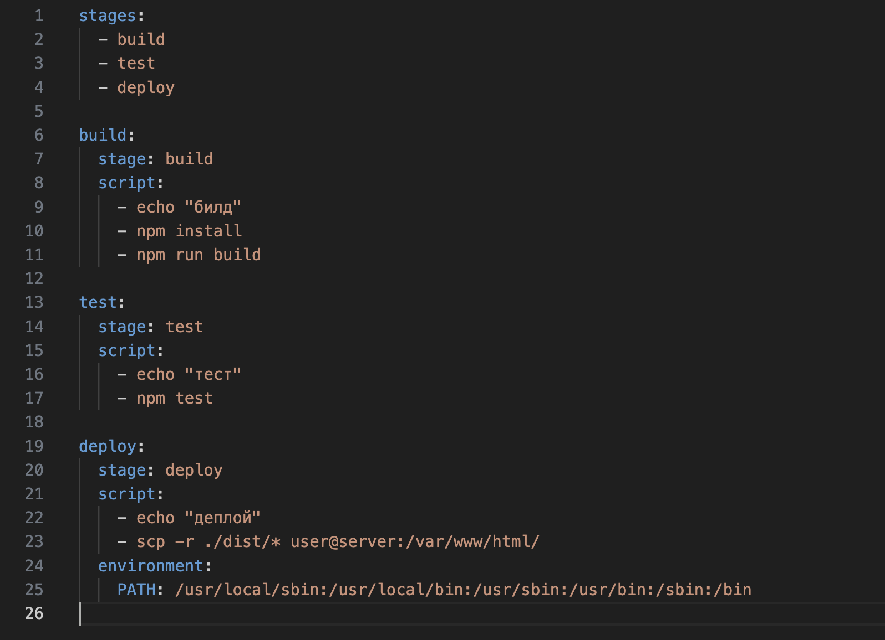
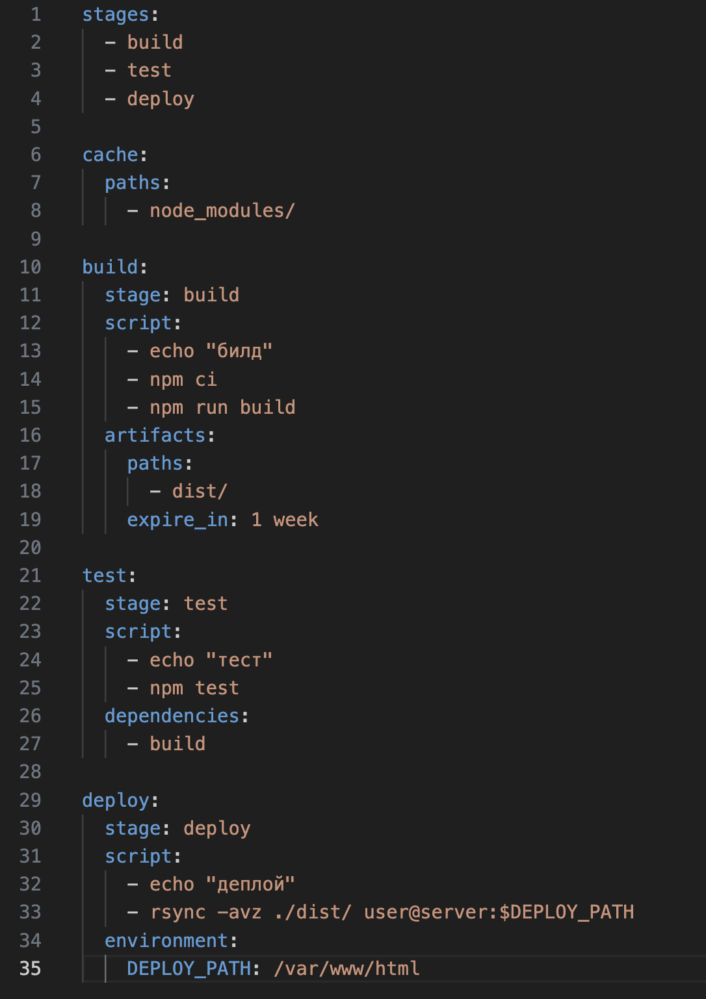

# Лабораторная работа №3

Выполнили: Коваленко Евгений Юрьевич, Шаповалов Сергей Кириллович, K3141

## “Плохой” CI/CD файл



## “Хороший” CI/CD файл



## Объяснение и решений проблем

1. Кэширование. В первом файле нет кэширования, каждый раз зависимости загружаются заново, это приводит к замедлению сборки. В good CI/CD добавлено кэширование зависимостей, что позволяет сохранять скачанные зависимости между сборками и экономить время на их повторную установку: 
    ```
    cache:
        paths:
            - node_modules/
    ```

2. В bad CI/CD file используется команда ```npm install``` для установки зависимостей. Эта команда может иногда устанавливать разные версии пакетов, если их обновили, это может привести к тому, что код будет работать не так, как ожидалось. В good CI/CD файле используется команда ```npm ci```, которая гарантирует установку точно тех версий, которые зафиксированы в ```package-lock.json```, что делает процесс сборки более стабильным и возможно более быстрым.

3. Артефакты сборки. В первом файле нет хранения артефактов сборки, что может вызвать проблемы при дальнейших стадиях, так как они необходимы для тестирования, развертывания и управления программными приложениями. Решением стало сохранение артефатов:
    ```
    artifacts:
        paths:
            - dist/
    ```
    P.s в целом можно было воткнуть еще срок хранение через ```expire_in:``` но мы так и не поняли насколько это целисообразно если гитлаб например сам очищает старые артефакты через определённое время.

4. Безопасная команда для деплоя. В bad CI/CD для деплоя используется команда ```scp```, которая менее оптимальна и менее безопасна по сравнению с альтернативой, такой как ```rsync```, которую мы и использовали в good CI/CD. Так же путь деплоя вынесен в переменную ```DEPLOY_PATH```, что позволяет легко изменять целевой путь без правки скрипта.

5. Зависимости между стадиями. В CI/CD файле стадии ```test``` и ```deploy``` не зависят друг от друга, что может привести к тому, что тесты выполняются без результатов сборки или деплой выполняется без успешных тестов. Во втором файле мы добавили добавили зависимоть между стадиями, что гарантирует , что тесты выполняются на основе артефактов сборки: 
    ```
    dependencies:
    - build
    ```


## Вывод по лабораторной

Было интересно разобраться в чем-то новом и получить много новых знаний, начиная с того, что такое CI/CD в целом, и заканчивая двухчасовыми гайдами по настройке CI/CD в проектах. Спасибо за лабораторную!