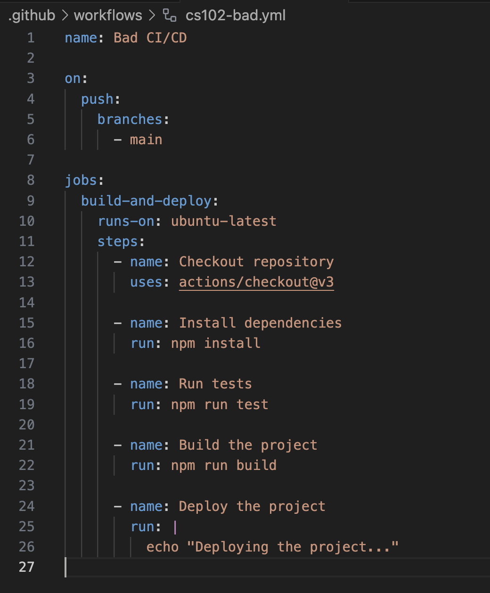
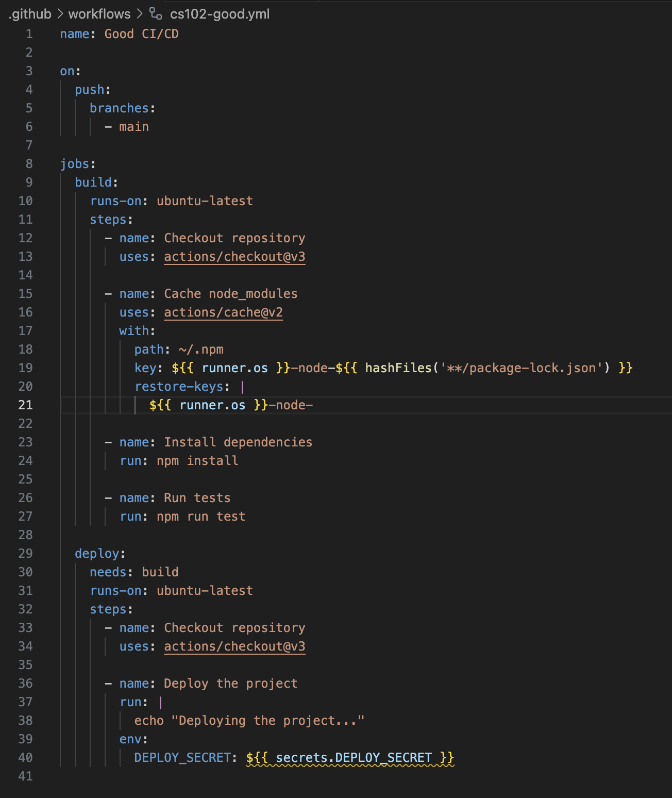
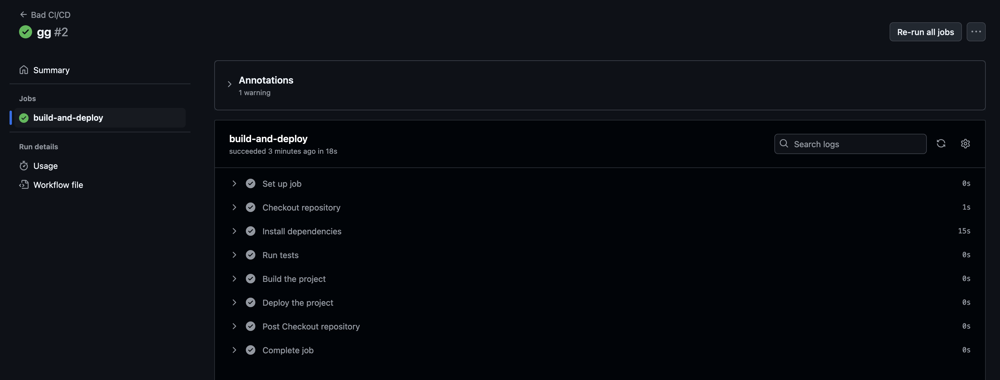
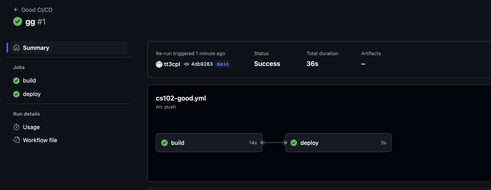

# Лабораторная работа №3

Выполнили: Коваленко Евгений Юрьевич, Шаповалов Сергей Кириллович, K3141

## “Плохой” CI/CD файл



## “Хороший” CI/CD файл



## Сравнение плохого и хорошего CI/CD

### 1. Кэширование зависимостей

**Проблема:** В первом файле CI/CD отсутствует механизм кэширования зависимостей. Это приводит к тому, что зависимости загружаются заново при каждом запуске, что увеличивает время сборки.

**Решение:** Во втором файле добавлено кэширование зависимостей с использованием `actions/cache`, что позволяет сохранить скачанные пакеты между сборками и значительно ускоряет процесс:

```yaml
- name: Cache node_modules
  uses: actions/cache@v2
  with:
    path: ~/.npm
    key: ${{ runner.os }}-node-${{ hashFiles('**/package-lock.json') }}
    restore-keys: |
      ${{ runner.os }}-node-
```

### 2. Установка зависимостей

**Проблема:** В первом файле используется команда `npm install` для установки зависимостей. Она может устанавливать разные версии пакетов, если они обновлены, что приводит к непредсказуемым результатам.

**Решение:** Во втором файле используется команда `npm ci`, которая гарантирует установку зависимостей именно тех версий, которые указаны в `package-lock.json`, что делает процесс сборки более стабильным и быстрым:

```yaml
- name: Install dependencies
  run: npm ci
```

### 3. Хранение артефактов сборки

**Проблема:** В первом файле отсутствует сохранение артефактов сборки, что может вызвать проблемы на дальнейших этапах, например, при тестировании или деплое.

**Решение:** Во втором файле добавлено сохранение артефактов сборки, что позволяет использовать их на следующих этапах CI/CD:

```yaml
- name: Save build artifacts
  uses: actions/upload-artifact@v3
  with:
    name: build-artifacts
    path: ./dist
```

### 4. Безопасное использование секретов для деплоя

**Проблема:** В первом файле деплой выполняется без использования секретов или переменных окружения для хранения конфиденциальных данных, что может привести к утечке информации.

**Решение:** Во втором файле деплой использует секреты, передавая их в переменные окружения, что гарантирует безопасность данных:

```yaml
- name: Deploy the project
  run: echo "Deploying the project..."
  env:
    DEPLOY_SECRET: ${{ secrets.DEPLOY_SECRET }}
```

### 5. Зависимости между стадиями

**Проблема:** В первом файле стадии `test` и `deploy` не зависят друг от друга, что может привести к тому, что деплой выполняется без успешного завершения тестов.

**Решение:** Во втором файле добавлена зависимость между стадиями с помощью ключевого слова `needs`, что гарантирует, что деплой будет выполнен только после успешной сборки и прохождения тестов:

```yaml
jobs:
  deploy:
    needs: build
    runs-on: ubuntu-latest
    steps:
      - name: Deploy the project
        run: echo "Deploying the project..."
```

## Pipelines good и bad CI/CD:
### Pipeline “плохого” CI/CD файл



### Pipeline “хорошего” CI/CD файл



## Вывод по лабораторной

Было интересно разобраться в чем-то новом и получить много новых знаний, начиная с того, что такое CI/CD в целом, и заканчивая двухчасовыми гайдами по настройке CI/CD в проектах. Спасибо за лабораторную!