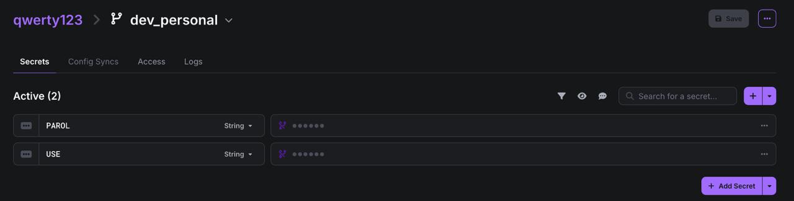
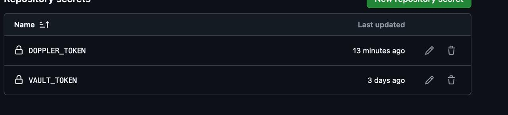
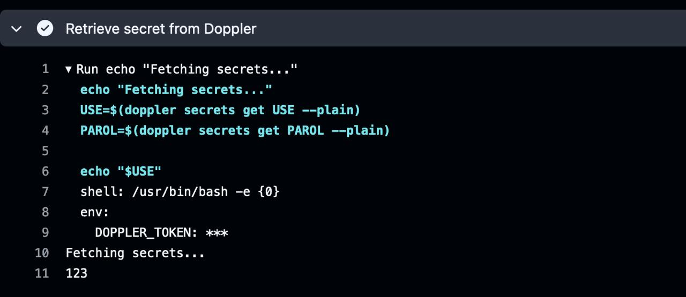

# Лабораторная работа №3*

Выполнили: Коваленко Евгений Юрьевич, Шаповалов Сергей Кириллович, K3141

## И так что мы сделали:

Так как перед нами стояла задача переделать лабу, но через HashiCorp Vault это оказалось сделать сложно, мы зашли на наш любимый хабр и посмотрели какие еще есть методы скрывания на втором месте HashiCorp Vault стоял Doppler, туда мы и зашли, допплер оказаался намного проще из-за своего интерфейса и в подсказок которые вели нас по ходу создавания проекта в нем

После того как мы создали проект и добавили в него секреты, мы выкачали токен для подключения на гите и собвенно добавили его в секреты гита 

Дальше дело вроде пошло в гору (ну насколько мы поняли лабу в целом) Мы создали новый ci с выгрузкой токена проекта и потом выгрузкой секретов которые мы добавили в наш допплер

Ну и в логах у нас токен не светится, это значит, что никто секреты не увидит, а в секреты которые мы берем берутся и используются (главное как мы их не светить в ci через echo):

# Выводы

Отвечая на вопросы по лабе "почему хранение секретов в CI/CD переменных репозитория не является хорошей практикой?:

1. Риски утечек

    Если случайно вывести секреты в логи, они могут стать доступными посторонним. Например, если секреты или API-ключи выводятся на экран во время выполнения пайплайна, их могут перехватить и украсть и все ггвп (хотя рано писать гг пока трон стоит)

2. Отсутствие централизованного управления

    Когда секреты хранятся прямо в CI/CD переменных, их управление и обновление становятся менее гибкими. Нужно будет вручную обновлять их в разных местах. Поэтому проще использовать например как мы Doppler, в котором могут храниться огромное количество секретов и всех их будет удобно доставать

Отвечая на вопрос в комментарие: 

  * Localhost — это адрес указывающий на сам компьютер, с которого происходит подключение. GitHub не может подключиться к localhost, потому что он находится в облаке, а не на локальном устройстве, и не имеет доступа к сервисам работающим только на моем компьютере. Это был наш факап действительно...

# P.S 
 
Мы надеемся что мы парвильно поняли лабу и нам не надо ее переделывать будет, в целом мы поняли принцип как прятать секреты, типа как вот с Doppler`ом что у нас все секреты там и чтобы мы там админ логин и пароль не спалили от сервака в нашем ci его не пишем а просто через сторонний сервис их вызываем и не палим а ci дальше идет

