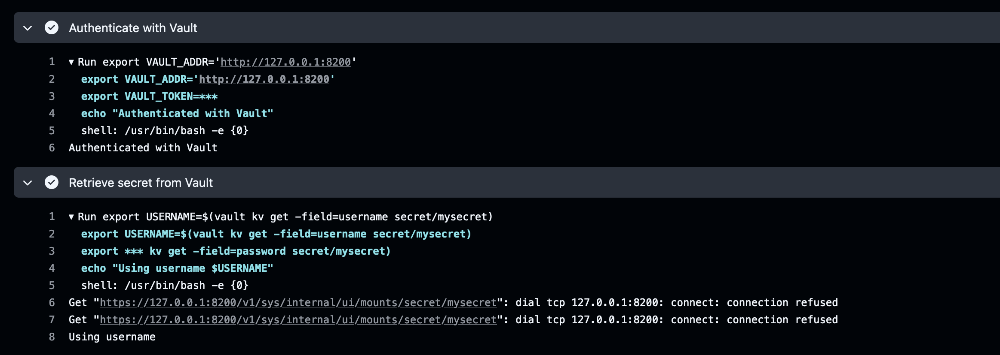
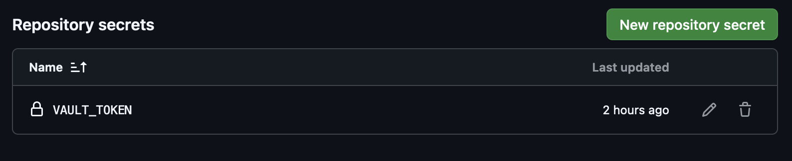
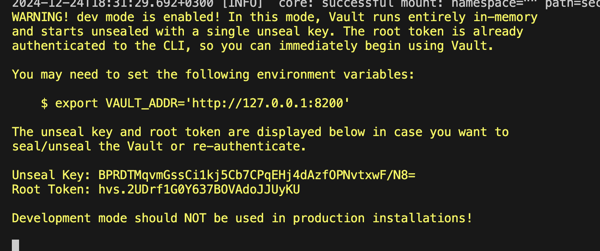
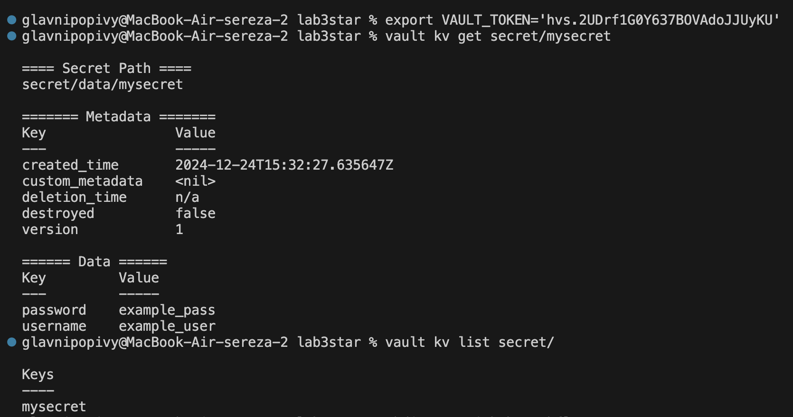

# Лабораторная работа №3*

Выполнили: Коваленко Евгений Юрьевич, Шаповалов Сергей Кириллович, K3141

## И так что мы сделали:

Ну фто начнем..
Перед нами стояла задача сделать так чтобы наш секрет не светился в логах, ну, в целом мы это и сделали, что наверное очевидно ведь иначе и отчета бы не существовало. 

Мы использовали HashiCorp Vault - это красивое и удобное решение для управления секретами, которое сочетает в себе безопасность, гибкость и простоту. (хммм мы так заумно умеем мыслить🤓. вы нас простите мы уже устали это все делать уже нет мыслей что в отчет написать) 

Основные аргументы почему он:
   1. Централизованное управление секретами
  * HashiCorp Vault предоставляет централизованное хранилище для всех секретов по типу паролей, API, сертификатов и т.д., что значительно упрощает их управление. С помощью Vault все данные защищены, и доступ к ним контролируется в одном месте.
    
  * Красота решения: Вместо того чтобы разбрасывать секреты по разным местам, типа кфг-файлов, Vault позволяет иметь один источник правды для всех секретов, упрощая управление.

  2. Интеграция с CI/CD и другими сервисами

   * Vault легко интегрируется с CI/CD пайплайнами, что позволяет получать секреты в нужный момент без необходимости хранить их в коде. В CI/CD пайплайнах можно настроить автоматическое извлечение секретов в переменные окружения, что предотвращает утечку данных в логах или в репозиториях.

   * Красота решения: Вместо того чтобы хранить секреты в коде или переменных окружения, Vault позволяет забрать их в нужный момент без выставления их на виду в логах. Это повышает безопасность и чистоту процессов.

   3. Поддержка временных секретов и динамического доступа

   * Vault позволяет генерировать временные секреты, которые действуют ограниченное время, и автоматически обновлять их по мере необходимости. Это особенно удобно для облачных и микросервисных архитектур, где приложения могут использовать секреты на определенный промежуток времени и не рисковать их утечкой при хранении.

   * Красота решения: Вместо того чтобы поддерживать постоянные ключи или пароли, которые могут быть украдены или забыты, Vault позволяет динамически создавать временные креденциалы с ограниченным сроком действия.

   * это было написано в интернете и показалось нам небольшим плюсом в использовании

## Скрины pipeline и секрета🤫 который мы и поместили в Vault:
#### как можем видеть в логах секрет не светится





## Ответи на вапрос "почему хранение секретов в CI/CD переменных репозитория не является хорошей практикой?:
1. Риски утечек

    Хранение секретов в переменных CI/CD репозитория может быть опасным, если кто-то получит доступ к репозиторию или его настройкам. Даже если код защищен, злоумышленник может изменить настройки и получить секреты.

    Если случайно вывести секреты в логи, они могут стать доступными посторонним. Например, если секреты или API-ключи выводятся на экран во время выполнения пайплайна, их могут перехватить и украсть и все ггвп (хотя рано писать гг пока трон стоит)

2. Отсутствие централизованного управления

    Когда секреты хранятся прямо в CI/CD переменных, их управление и обновление становятся менее гибкими. Вам нужно будет вручную обновлять их в разных местах. Поэтому мы и использовали Vault и посчитали это красивой и удобной парактикой, так как Vault позволяет централизованно управлять доступом к секретам, контролировать их обновления и доступность

3. Шифрование:

    Vault обеспечивает шифрование данных на уровне сервера, а также аудирование и управление доступом, что дает нам больший контроль над секретами, но если мы храним секреты в переменных ci/cd, то они могут быть плохо защищены и не поддаваться полноценному контролю и проверке.

## Вывод:
В ходе лабораторной работы мы узнали, что секреты можно ПРЯТАТЬ😱😨. Ну, в целом, на самом деле, это было правда интересно, сидеть и получать злополучные галочки на гите, и сильно радоваться тому, когда они появляются, было интерсным зрелищем. В общем ```Vault``` довольно красивый, простой и понятный способ скрытия секретов и мы надеемся, что в будующем при работе на кого-нибудь(нас) нам пригодятся эти знания

## Ссылки:
[ссылка на логи ну и там можно ci/cd найти](https://github.com/tt3cpl/lab3star/actions/runs/12483643378/job/34839742491)