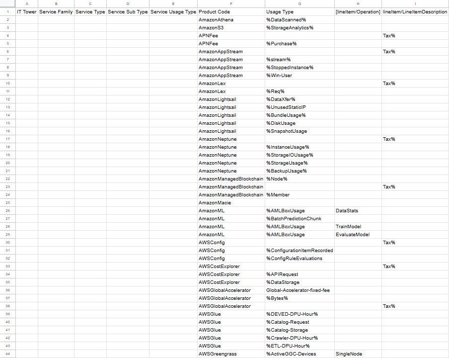
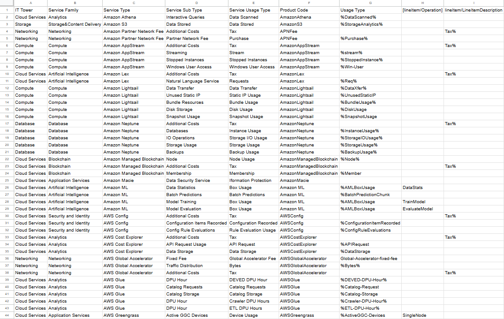
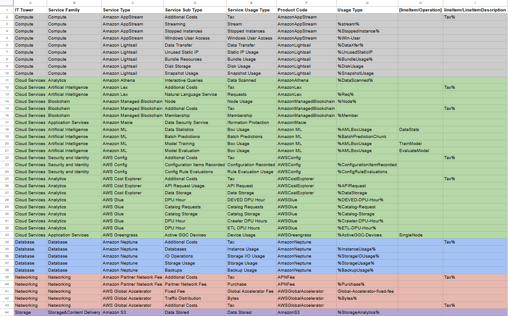

# Лабораторная работа 1. Знакомство с IaaS, PaaS, SaaS сервисами в облаке на примере Amazon Web Services (AWS). Создание сервисной модели.

## Выполнили:

Коваленко Евгений, Шаповалов Сергей, K3241

## Цель работы

Знакомство с облачными сервисами. Понимание уровней абстракции над инфраструктурой в облаке. Формирование понимания типов потребления сервисов в сервисной-модели. 

## Дано

1. Слепок данных биллинга от провайдера после небольшой обработки в виде SQL-параметров. Символ % в начале/конце означает, что перед/после него может стоять любой набор символов.
2. Образец итогового соответствия, что желательно получить в конце. В этом же документе  

## Необходимо

1. Импортировать файл .csv в Excel или любую другую программу работы с таблицами. Для Excel делается на вкладке Данные – Из текстового / csv файла – выбрать файл, разделитель – точка с запятой.
2. Распределить потребление сервисов по иерархии, чтобы можно было провести анализ от большего к меньшему (напр. От всех вычислительных ресурсов Compute дойти до конкретного типа использования - Выделенной стойка в датацентре Dedicated host usage).
3. Сохранить файл и залить в соответствующую папку на Google Drive.

## Алгоритм работы

Сопоставить входящие данные от провайдера с его же документацией. Написать в соответствие колонкам справа значения 5 колонок слева, которые бы однозначно классифицировали тип сервиса. Для столбцов IT Tower и Service Family значения можно выбрать из образца.

## Ход работы

Вот такое счастье нам досталось (11 вариант):

Давайте опишем каждый сервис.
1. **Amazon Athena** - это аналитический сервис, с помощью которого можно анализировать данные и создавать приложения на основе данных Amazon S3, используя SQL и Python.

2. **Amazon S3** - это облачный сервис хранения объектов, который позволяет клиентам хранить и защищать нужный им объем данных.

3. **APNFee** - это партнерский сервис, предоставляющий участникам различные инструменты, услуги и программы (но это только если платить по 2500$ в год).

4. **Amazon AppStream** - это вычислительный сервис, который позволяет настроить потоковую передачу приложений в формате SaaS и преобразовать приложения рабочего стола в приложения SaaS (своего рода запускатель приложений в браузере).

5. **Amazon Lex** - это сервис ИИ с моделями естественного языка, с помощью которого можно создавать и проектировать чат-ботов и голосовых ботов с ИИ в приложениях.

6. **Amazon Lightsail** - это сервис (VPS), который предлагает контейнеры, хранилища и БД.

7. **Amazon Neptune** - это бессерверная масштабируемая (и вообще очень крутая) БД.

8. **Amazon Managed Blockchain** - это сервис, с помощью которого можно с нуля и до полного продукта создать отказоустойчивые приложения в блокчейнах.

9. **Amazon Macie** - это сервис, обнаруживающий конфиденциальные данные и исследующий риски для безопасности данных через нейронку.

10. **Amazon ML** - это высокопроизводительный и масштабируемый сервис, который предоставляет инструменты для создания нейронок.

11. **AWS Config** - это сервис, который обеспечивает доступ к конфигурации ресурсов AWS.

12. **AWS Cost Explorer** - это очень полезный ~~(для бедных или финансово грамотных)~~ сервис, с помощью которого можно (нужно) визуализировать и анализировать затраты и использование ресурсов AWS.

13. **AWS Global Accelerator** - это сервис, повышающий доступность, производительность и безопасность приложений, который направляет пользователей на самый быстрый сервер глобальной сети AWS.

14. **AWS Glue** - это бессерверный сервис интеграции данных, упрощающий работу с данными для анализа, машинного обучения и разработки.

15. **AWS Greengrass** - это облачный сервис с открытым исходным кодом для создания, развертывания и управления ПО для устройств.

С помощью [документации](https://docs.aws.amazon.com/) (ладно, будем честны, что-то искали и на не особо авторитетных источниках) мы построили такую таблицу (заполнили ячейки):

А теперь сделаем красиво:

А вот [здесь](https://docs.google.com/spreadsheets/d/1E5HlhVeisTzN1fwPfl6PcrZui6sOWmdLxvGOfLxJkiw/edit?usp=sharing) ссылка на таблицу.

## Вывод

Лаба сама по себе очень сложная в том плане, что мы несколько дней убили на штудирование документации. Но вот сейчас смотрим на эту таблицу и понимаем, что в ней все более чем логично, есть прикольная структура. С момента отзыва на первый вариант нашего решения мы поняли, что делений по столбцам может быть несколько, а мы, надеемся, предоставили пусть и самое легкое, но верное деление. Третий (после лабы по Azure) раз мы бы такое делать не стали, но опыт интересный :)