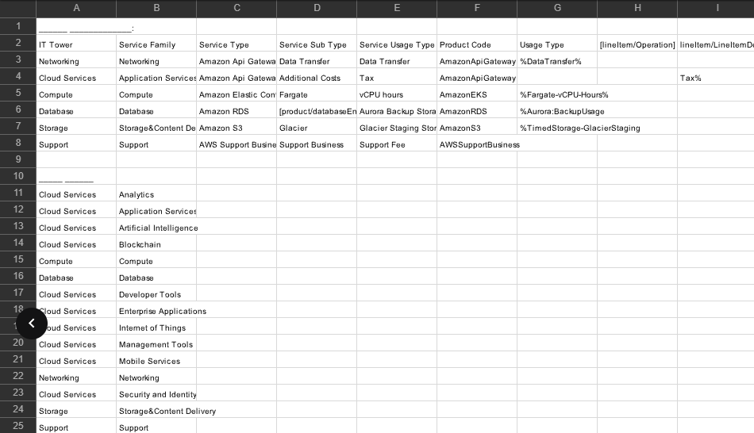
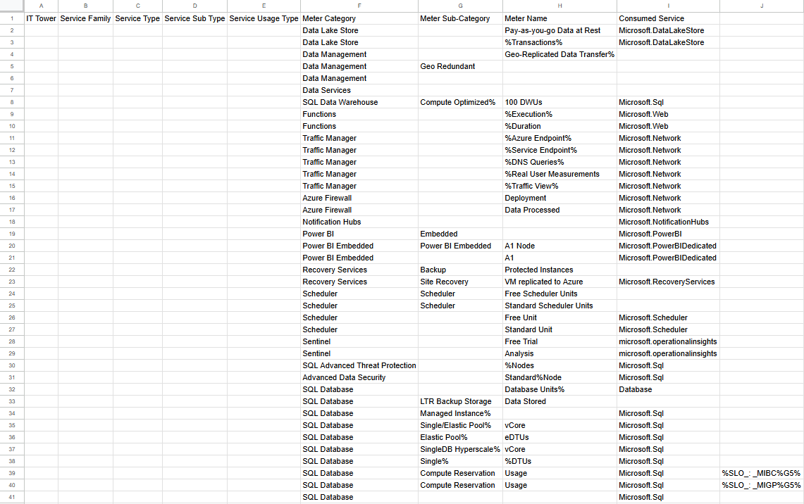
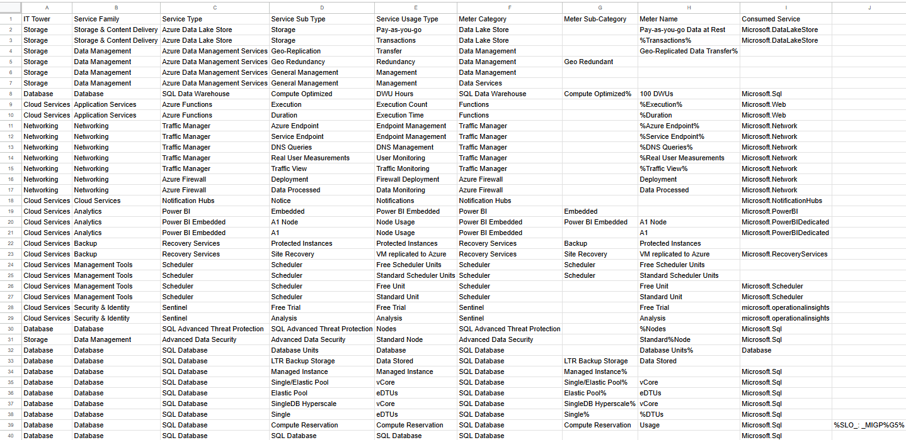
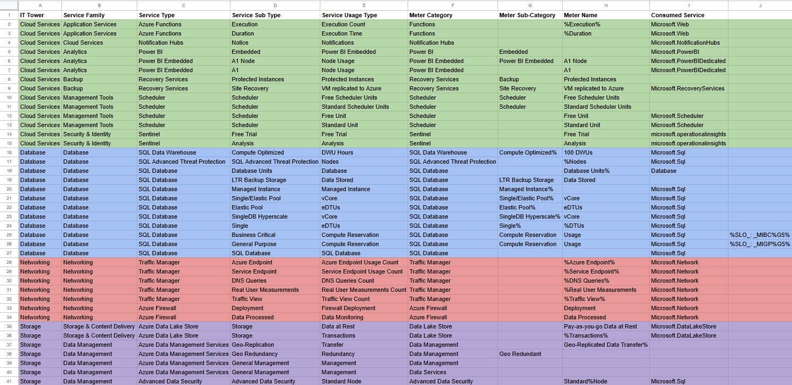

# Лабораторная работа 2. Сравнение сервисов Amazon Web Services и Microsoft Azure. Создание единой кросс-провайдерной сервисной модели.

## Выполнили:

Коваленко Евгений, Шаповалов Сергей, K3241

## Цель работы

Получение навыков аналитики и понимания спектра публичных облачных сервисов без привязки к вендору. Формирование у студентов комплексного видения Облака.

## Дано

1. Данные лабораторной работы 1.
2. Слепок данных биллинга от провайдера после небольшой обработки в виде SQL-параметров. Символ % в начале/конце означает, что перед/после него может стоять любой набор символов.
3. Образец итогового соответствия, что желательно получить в конце. В этом же документе

## Необходимо

1. Импортировать файл .csv в Excel или любую другую программу работы с таблицами. Для Excel делается на вкладке Данные – Из текстового / csv файла – выбрать файл, разделитель – точка с запятой.
2. Распределить потребление сервисов по иерархии, чтобы можно было провести анализ от большего к меньшему (напр. От всех вычислительных ресурсов Compute дойти до конкретного типа использования - Выделенной стойка в датацентре Dedicated host usage). При этом сохранять логическую концепцию, выработанную в Лабораторной работе 1.
3. Сохранить файл и залить в соответствующую папку на Google Drive.

## Алгоритм работы

Сопоставить входящие данные от провайдера с его же документацией. Написать в соответствие колонкам справа значения 5 колонок слева, которые бы однозначно классифицировали тип сервиса. Для столбцов IT Tower и Service Family значения можно выбрать из образца. В ходе выполнения работы не отходить от принципов классификации, выбранных в Лабораторной работе 1. Например, если сервис Машинного обучения был разбит на Вычислительные мощности и Облачные сервисы, то продолжать его разбивать и в новых данных. Пример:

## Ход работы

Вот такое счастье нам досталось (11 вариант):

Давайте опишем каждый сервис.

1. **Azure Data Lake Store** - это хранилище данных, нужное, чтобы обрабатывать большие объемы данных в неструктурированном формате.

2. **Azure Data Management Services** - это набор инструментов для управления данными в облаке (интеграция и безопасность данных).

3. **SQL Data Warehouse** - это облачное решение для хранения данных, которое предназначено для работы с большими объемами информации.

4. **Azure Functions** - это сервис для создания бессерверных приложений, который позволяет запускать код (но сервис очень простой, потому что не нужно управлять серверами или инфраструктурой).

5. **Traffic Manager** - это сервис для управления трафиком, который помогает направлять пользователей к ближайшему доступному серверу (как AWS Global Accelerator).

6. **Azure Firewall** - это облачный межсетевой экран для защиты сетевой инфраструктуры с фильтрацией трафика и блокировкой нежелательных подключений.

7. **Notification Hubs** - сервис для отправки уведомлений на мобильные устройства, веб-приложения и другие платформы.

8. **Power BI** - это инструмент для аналитики и визуализации данных, в котором можно создавать отчеты и дашборды (типа инструмент для бизнес-анализа).

9. **Power BI Embedded** - это версия Power BI, предназначенная для встраивания аналитики в приложения и веб-сайты.

10. **Recovery Services** - это сервис для защиты и восстановления данных, который помогает делать резервные копии и восстанавливать приложения после сбоев.

11. **Scheduler** - сервис для планирования и автоматизации задач по расписанию (запуск ВМ или выполнение скриптов).

12. **Sentinel** - это облачная система для управления безопасностью и мониторинга угроз с использованием ИИ.

13. **SQL Advanced Threat Protection** - это сервис для защиты БД от угроз и атак.

14. **Advanced Data Security** - сервис для повышения безопасности данных в облаке (шифрование, мониторинг и анализ безопасности данных).

15. **SQL Database** - это облачная платформа для хранения и управления БД.

С помощью [документации](https://learn.microsoft.com/ru-ru/azure/?product=popular) (ладно, будем честны, что-то искали и на не особо авторитетных источниках) мы построили такую таблицу (заполнили ячейки) (НЕАКТУАЛЬНЫЙ СКРИН, просто правки не такие большие, я их сделал сразу в закрашенной таблице, этот скрин оставлю для видимости наличия процесса работы):

А теперь сделаем красиво:

А вот [здесь](https://docs.google.com/spreadsheets/d/1pC1C_fw87a74CfLwqjfmHWNtOJE9JHKcaauZ-2MzVPU/edit?usp=sharing) ссылка на таблицу.

## Вывод

Эта лаба, если честно, далась нам проще, чем по AWS. Наверное, мы уже лучше поняли, что и как нужно делать. Было интересно покопаться в интернетах и подумать :) Еще мы увидели аналогии с AWS.