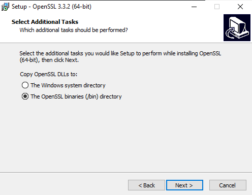
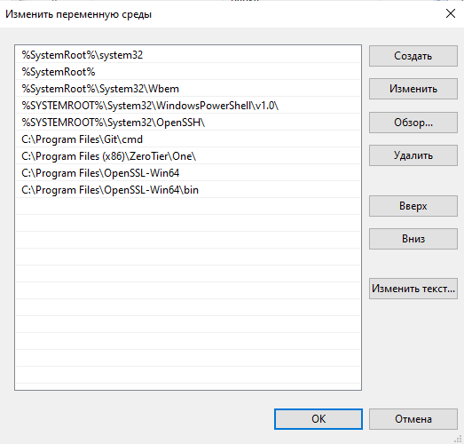

# Лабораторная работа №1

Выполнили: Коваленко Евгений Юрьевич, Шаповалов Сергей Кириллович, K3141

## Ход работы

Работа выполняется на Windows 10.

Перед началом работы создадим два простейших веб-приложения с помощью FastAPI ([app1.py](..%2Fapp1%2Fapp1.py), [app2.py](..%2Fapp2%2Fapp2.py)) и опишем зависимости используемых библиотек в файле [requirements.txt](..%2Frequirements.txt) для того, чтобы любой мог простым способом запустить их.

Теперь установим nginx. Переходим на [страницу загрузки nginx](https://nginx.org/ru/download.html) и скачиваем версию `1.26.2`. Извлекаем содержимое zip-папки. Ищем в папке приложение `nginx.exe`. На скриншоте ниже показан возможный путь до этого файла.


Проверим работу nginx. Запустим приложение и перейдем по адресу http://localhost. Здесь нас ожидает подвтерждение того, что nginx успешно запустился:


Теперь остановим nginx. Для этого открываем командную строку, с помощью команды `cd` переходим в директорию, в которой "живет" файл `nginx.exe` и останавливаем его командой `nginx.exe -s stop`. Эта команда не должна вернуть никакой информации, а для проверки того, что nginx остановлен, можно снова перейти на [http://localhost]() и получить ошибку.


1. Приступим к созданию самоподписанного SSL-сертификата для обеспечения HTTPS-соединения. Переходим на [страницу загрузки дистрибутива OpenSSL](https://slproweb.com/products/Win32OpenSSL.html) и устанавливаем файл `.exe` (мы установили `v3.3.2`).

   Запускаем скачавшееся приложение. Соглашаемся с условиями, трижды идем далее. Если будет предложено установить `Microsoft Visual Studio C++` - устанавливаем, без него утилита не сможет работать.

   На четвертом шаге выбираем пункт как на скриншоте ниже.

   

   Идем до конца, ждем установки.

   Теперь нужно прописать путь к нашему приложению в переменных среды. Щелкаем правой кнопкой мыши на иконку "Пуск", далее "Система", ищем в поиске "Изменение системных переменных среды", далее "Дополнительно" -> "Переменные среды...". Выбираем системную переменную "Path" -> "Создать". Так добавляем путь к папкам `OpenSSL-Win64` и `OpenSSL-Win64\bin`, как на скриншоте ниже.

   

   Далее "ОК" -> "ОК" -> "ОК".

   Создаем папку, в которой будем хранить сертификаты. Запускаем командную строку от имени администратора.

   С помощью команды `cd` переходим в папку, которую создали. Далее генерируем приватный ключ командой `openssl genrsa -out server.key 2048`. Тут и пригодится установленный ранее Microsoft Visual Studio - без него программа выдаст ошибку.

   После этого выполняем запрос на сертификат командой `openssl req -new -key server.key -out server.csr` и указываем запрашиваемые данные. Вид исполнения команды показан на скриншоте ниже.

   

   Генерируем самоподписанный сертификат командой `openssl req -new -x509 -days 365 -key server.key -out server.crt`. Командная строка опять запросит данные - понятно, что ввести.

   Преобразуем сертификат и ключ в файл .pfx командой `openssl pkcs12 -inkey server.key -in server.crt -export -out server.pfx`. Нужно придумать пароль и ввести его - конечно, его будет не видно.

   На данный момент у нас есть файлы как на скриншоте ниже.

   

   Теперь нужно импортировать сертификат в наш веб-сервер. Для этого заходим в "Панель управления" -> "Программы" -> "Включение или отключение компонентов Windows". Включаем внедряемое веб-ядро служб IIS и службы IIS (выбираем службы Интернета и средства управления веб-сервером). Ждем применения изменений, закрываем.

   Ищем "Диспетчер служб IIS" -> "Сертификаты сервера" -> "Импортировать" -> вводим путь до файла `server.pfx` и пароль -> "ОК". Теперь переходим в папку "сайты" -> "Default Web Site" -> "Привязки" -> "Добавить" -> выбираем `https` и SSL-сертификат -> "ОК". Итог должен выглядеть как на скриншоте ниже.

   

   Закрываем, нажимаем "Перезапустить". Закрываем диспетчер.

   Вернемся на первый скриншот. Для удобства скопируем нашу папку в репозиторий, затем перейдем в папку `conf` и откроем конфигурационный файл `nginx.conf`. В нем нам потребуется найти блок `server { ... }`и изменить следующие строки:

   ```
   server {
       listen 443 ssl;
       server_name _;

       ssl_certificate "C:\OpenSSL\server.crt";
       ssl_certificate_key "C:\OpenSSL\server.key";
   }
   ```

   Здесь мы задали `443` порт, имя сервера (`_` означает, что блок распространяется на любой сайт) и пути к сертификату и ключу.

2. Теперь необходимо настроить принудительное перенаправление HTTP-запросов (порт 80) на HTTPS (порт 443) для обеспечения безопасного соединения.

   Ищем в файле `nginx.conf` блок `http { ... }` и добавляем новый блок:

   ```
   server {
   
       # Блок для переадресации HTTP на HTTPS
       
       listen 80;
       server_name _;
       return 301 https://$server_name$request_uri;
   }
   ```

   Здесь мы указываем, что будем слушать порт 80. `return 301 https://$server_name$request_uri;` - это ключевая строка, которая отвечает за переадресацию. Когда пользователь обращается по HTTP, Nginx возвращает ответ с кодом 301 (постоянное перенаправление), указывая новый адрес в формате HTTPS. Переменная `$server_name` используется для передачи доменного имени, а `$request_uri` - для сохранения исходного адреса запроса.

3. Теперь нужно использовать alias для создания псевдонимов путей к файлам или каталогам на сервере.

   Мы помним, что у нас есть два приложения, которые доступны по следующим путям: `app1/app1.py` и `app2/app2.py`. Дополним конфигурационный файл новым блоком:

   ```
   server {
       listen 443 ssl;
       server_name http://localhost;

       ssl_certificate "C:\OpenSSL\server.crt";
       ssl_certificate_key "C:\OpenSSL\server.key";

       location / {
           alias C:\Users\05kov\PycharmProjects\itmo_devops_clouds_course\app1;
           index index.html index.htm;
       }
   }
   ```

   В строке с `alias` ужно указать путь до своей папки (здесь, конечно, указано до нашей). Чтобы второе приложение работало, нужно добавить еще один такой же блок, просто изменив путь до второго проекта.

   На самом деле, мы уже использовали часть этого блока в первом пункте. Значит, достаточно дописать в этот блок оставшиеся строки.

4. Собственно, виртуальные хосты для обслуживания нескольких доменных имен на одном сервере уже настроены.

Кажется, лабораторная работа подошла к концу.

## Вывод

В данной лабораторной работе была проделана гигантская и местами непонятная работа - настройка nginx для перенаправления всех запросов с http на https.

За четыре дня удалось разобраться в тонкостях работы nginx.